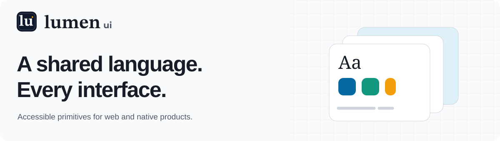

<p align="center">
  <a href="https://lumen.santi020k.com">
    <picture>
      <source media="(prefers-color-scheme: dark)" srcset="./docs/assets/readme/hero-dark.svg">
      
    </picture>
  </a>
</p>

<h1 align="center">Lumen UI</h1>

<p align="center">
  <strong>Accessible primitives. Native authoring. Shared foundations.</strong><br>
  An open-source UI system for Astro, React, Web Components, React Native, SwiftUI, and Jetpack Compose.
</p>

<p align="center">
  <a href="https://lumen.santi020k.com">Documentation</a> ·
  <a href="https://lumen.santi020k.com/docs/components">Components</a> ·
  <a href="https://lumen.santi020k.com/#playgrounds">Playgrounds</a> ·
  <a href="https://www.figma.com/community/file/1662337342676541513">Figma library</a> ·
  <a href="https://lumen.santi020k.com/support">Support</a>
</p>

<p align="center">
  <a href="https://github.com/santi020k/lumen/actions/workflows/ci.yml"></a>
  <a href="https://github.com/santi020k/lumen/actions/workflows/codeql.yml"></a>
  <a href="https://www.npmjs.com/package/@santi020k/lumen-astro"></a>
  <a href="./LICENSE"></a>
</p>

Lumen gives your product a consistent visual language while preserving each framework's native
way of building. Compose accessible controls, forms, charts, and complete product layouts from
shared tokens and explicit component contracts.

**Explore:** [Quick start](#web-quick-start) · [Native apps](#native-playgrounds) · [Templates](#dashboards-and-templates) · [AI and Figma](#ai-and-design-workflows) · [Packages](#packages) · [Repository apps](#repository-apps) · [Contributing](#contributing)

> **Lumen 4 candidate:** This branch documents the upcoming major version. The npm badge reports
> the published version; local examples and store builds may differ. See the
> [migration and readiness notes](#lumen-4-candidate) before upgrading.

## See Lumen in action

<p>
  <a href="https://lumen.santi020k.com/docs/web/playground">
    
  </a>
</p>

*Real Lumen components with illustrative data. [Open the web playground →](https://lumen.santi020k.com/docs/web/playground)*

| Built for | What you get |
| --- | --- |
| **Web products** | Astro, React, and custom elements with standalone CSS and optional Tailwind integration. |
| **Native interfaces** | React Native, SwiftUI, Compose, WidgetKit, and Wear OS foundations with platform conventions. |
| **Accessible interaction** | Semantic structure, keyboard paths, focus management, and reduced-motion support. |
| **Design and AI workflows** | Figma resources, a portable agent skill, MCP discovery, and machine-readable contracts. |

## Web quick start

Choose one adapter. Astro requires Astro 5+, React requires React 19+, and the web packages
require Node.js 22.12+ for their tooling. Install in your existing application:

```bash
# Astro
pnpm add @santi020k/lumen-astro

# React
pnpm add @santi020k/lumen-react

# Web Components
pnpm add @santi020k/lumen-elements
```

### Astro

Import the stylesheet and mount `UIPrimitives` once in your root layout. The runtime enhances all
interactive Lumen markup on the page.

```astro
---
import '@santi020k/lumen-astro/styles.css'
import UIPrimitives from '@santi020k/lumen-astro/runtime'
---

<html lang="en">
  <body>
    <slot />
    <UIPrimitives />
  </body>
</html>
```

```astro
---
import { Button, Card, Input, Label } from '@santi020k/lumen-astro'
---

<Card>
  <Label for="email">Email</Label>
  <Input id="email" name="email" type="email" placeholder="you@example.com" />
  <Button>Subscribe</Button>
</Card>
```

### React

Load the stylesheet once from your app entry or global CSS:

```tsx
import '@santi020k/lumen-react/styles.css'
import { Button, Card, Input, Label } from '@santi020k/lumen-react'

export function SubscribeForm() {
  return (
    <Card>
      <Label htmlFor="email">Email</Label>
      <Input id="email" name="email" type="email" placeholder="you@example.com" />
      <Button>Subscribe</Button>
    </Card>
  )
}
```

### Web Components

Import the styles and register the elements once:

```html
<style>
  @import "@santi020k/lumen-elements/styles.css";
</style>

<script type="module">
  import { defineLumenElements } from '@santi020k/lumen-elements/define'

  defineLumenElements()
</script>

<lumen-card>
  <lumen-label id="email-label">Email</lumen-label>
  <lumen-input aria-labelledby="email-label" id="email" name="email" type="email" placeholder="you@example.com"></lumen-input>
  <lumen-button>Subscribe</lumen-button>
</lumen-card>
```

See the [Web documentation](https://lumen.santi020k.com/docs/web) for installation, theming,
component examples, and API details.

Browse the [package directory](https://lumen.santi020k.com/docs/packages) for framework adapters,
shared foundations, and optional integrations, with links to focused examples and usage guides.

For failure states, use the [error-handling guide](./docs/error-handling.md) to choose between field
feedback, summaries, persistent alerts, transient toasts, and the `ErrorState` recovery surface.
Lumen owns presentation and accessibility; applications retain logging, retry, and exception policy.

For native applications, choose the [React Native](https://lumen.santi020k.com/docs/react-native),
[Apple / SwiftUI](https://lumen.santi020k.com/docs/apple), or
[Android / Compose](https://lumen.santi020k.com/docs/android) guide. The
[shared foundations](https://lumen.santi020k.com/docs/foundations) explain the cross-platform token
and component contract; repository contributors can also use the
[cross-platform architecture](./docs/cross-platform.md) and
[native component reference](./docs/native-components.md).

> **Native qualification:** Check the [compatibility matrix](docs/native-compatibility.md) and
> [device evidence](docs/native-device-validation.md) for your target. Local builds, published
> artifacts, and physical-device accessibility are distinct verification steps.

## Tailwind CSS

Keep the layer prelude, Tailwind import, and Lumen stylesheet in the same shared CSS entry. Replace
`lumen-astro` with the package for your framework.

```css
@import "@santi020k/lumen-astro/layers.css";
@import "tailwindcss";
@import "@santi020k/lumen-astro/styles.css";
```

This order places Tailwind base styles before Lumen components and Tailwind utilities above Lumen
component defaults.

## Native playgrounds

<table>
  <tr>
    <th>SwiftUI</th>
    <th>Jetpack Compose</th>
    <th>React Native</th>
  </tr>
  <tr>
    <td><a href="https://lumen.santi020k.com/docs/apple/playground"></a></td>
    <td><a href="https://lumen.santi020k.com/docs/android/playground"></a></td>
    <td><a href="https://lumen.santi020k.com/docs/react-native/playground"></a></td>
  </tr>
  <tr>
    <td>Native app capture</td>
    <td>Native app capture</td>
    <td>Expo browser preview</td>
  </tr>
</table>

See [capture provenance](apps/docs/src/assets/platforms/README.md) for sources and verification scope.

Try Lumen before adding it to your project. The [playground section](https://lumen.santi020k.com/#playgrounds)
brings together the browser demos and native apps. Explore component states and themes, then use
the open-source apps as implementation references. Start with the
[web playground](https://lumen.santi020k.com/docs/web/playground) for Astro, React, and Web Components,
or choose a native gallery:

- [`apps/playground-react-native`](./apps/playground-react-native) runs through Expo on the web,
  iOS, and Android. [Try the browser preview](https://lumen.santi020k.com/docs/react-native/playground#preview)
  or use the local setup guide for native evaluation. EAS profiles cover TestFlight, Android App
  Bundles, and APKs; this gallery has no separate public store listing.
- [`apps/playground-apple`](./apps/playground-apple) is available on the
  [App Store](https://apps.apple.com/app/id6805250815) for iPhone, iPad, and Mac. It also builds as
  an iOS Xcode app or macOS Swift Package executable for local exploration.
- [`apps/playground-android`](./apps/playground-android) builds a native Compose application and a
  directly installable debug APK. It is also available on
  [Google Play](https://play.google.com/store/apps/details?id=com.santi020k.lumen.playground.compose)
  for Android phones and tablets.

See the [playground workflow](./docs/playgrounds.md) for a platform chooser, reference-app source,
and run, capture, and distribution commands. Store builds follow their own release schedule and
may differ from the current repository candidate.

## Appearance presets

Choose an appearance preset or customize the existing themes with the [appearance guide](docs/appearance-presets.md). The Studio preset uses PostLens as its visual reference.

## Dashboards and templates

Explore the [template gallery](https://lumen.santi020k.com/templates) for complete analytics,
SaaS admin, commerce, project workspace, and authentication/onboarding experiences. Each family
uses public Lumen primitives and semantic tokens, includes responsive and accessibility coverage,
and ships through the CLI for all three framework targets:

```bash
lumen add analytics-dashboard
lumen add commerce-dashboard --target react
lumen add auth-onboarding --target elements
```

## AI and design workflows

Install the portable Lumen skill in Codex, Claude Code, Cursor, Windsurf, and other compatible
coding agents:

```bash
npx skills add santi020k/lumen --skill lumen-ui
```

The skill teaches agents how to select, compose, theme, and verify Lumen primitives. Pair it with
[`@santi020k/lumen-mcp`](./packages/mcp) when an agent needs to search the live catalog or retrieve
current source, props, tokens, and usage rules.

For ChatGPT and Codex, install the published
[Lumen UI plugin](https://chatgpt.com/plugins/plugin_asdk_app_6a8f6c526c5481918eb8a48806fa112b)
from the Plugins Directory. Select **Install plugin**, then mention **@Lumen UI** in a request such
as “Find the right Lumen components for an accessible React settings screen.” The plugin bundles
the skill with the hosted, read-only catalog; no separate Lumen account or local MCP setup is needed.

Lumen is designed to reduce repetitive UI code and unnecessary agent context. Actual token usage
depends on the model, task, and corrections; see the [measurement method](docs/ai-efficiency.md).

<details>
<summary>Guides, registries, and integration references</summary>

Additional machine-readable surfaces include:

- [`llms.txt`](./llms.txt) for a concise project map.
- [`docs/ai-usage.md`](./docs/ai-usage.md) for downstream generation examples.
- [`docs/styling-contract.md`](./docs/styling-contract.md) for stable parts and component variables.
- [`docs/import-and-icon-performance.md`](./docs/import-and-icon-performance.md) for repeatable import and icon evidence.
- [`docs/graphics.md`](./docs/graphics.md) for portable decorative artwork across web and native platforms.
- [`docs/consumer-regression-fixtures.md`](./docs/consumer-regression-fixtures.md) for production-shaped local coverage.
- [`docs/project-adoption.md`](./docs/project-adoption.md) for the sibling-project audit and staged
  web and native migration strategy.
- [`registry/lumen.registry.json`](./registry/lumen.registry.json) for recipes and installable file
  groups.
- [`docs/figma.md`](./docs/figma.md) for Figma variables and Code Connect workflows.
- [`apps/figma-plugin/README.md`](./apps/figma-plugin/README.md) for the **beta** Figma plugin,
  Astro starters, and AI handoff.
- [`plugins/lumen-ui`](./plugins/lumen-ui) for the packaged Codex and ChatGPT plugin, with its
  [submission and review record](./docs/openai-plugin-submission.md).
- [`.claude-plugin/marketplace.json`](./.claude-plugin/marketplace.json) for the Claude Code
  marketplace, with its [installation and submission guide](./docs/claude-code-plugin.md).
- [`docs/cross-platform.md`](./docs/cross-platform.md) for the native architecture, support tiers,
  and component-parity policy.
- [`docs/native-patterns.md`](./docs/native-patterns.md) for developed native compositions and the
  boundary between Lumen presentation and platform-owned application structure.

</details>

## Packages

| Package | Purpose |
| --- | --- |
| [`@santi020k/lumen-astro`](./packages/astro) | Reference implementation, Astro components, and progressive-enhancement runtime |
| [`@santi020k/lumen-react`](./packages/react) | React components and behavior hooks |
| [`@santi020k/lumen-react-hook-form`](./packages/react-hook-form) | Optional React Hook Form adapters for composite controls |
| [`@santi020k/lumen-elements`](./packages/elements) | Standards-based Web Components |
| [`@santi020k/lumen-core`](./packages/core) | Shared tokens, metadata, class helpers, and behavior contracts |
| [`@santi020k/lumen-tokens`](./packages/tokens) | Canonical platform-neutral design token source |
| [`@santi020k/lumen-react-native`](./packages/react-native) | React Native foundations and native primitives |
| [`LumenUI`](./packages/swift) | Swift Package for iOS, iPadOS, macOS, tvOS, visionOS, and watchOS foundations and native primitives |
| [`LumenWidgetUI`](./packages/swift-widget) | Focused WidgetKit-safe semantic text, icon, badge, and compact-stat foundations |
| [`lumen-compose`](./packages/compose) | Android library for Jetpack Compose foundations and native primitives |
| [`lumen-compose-wear`](./packages/compose/wear) | Focused Wear OS primitives for at-a-glance round-screen actions, progress, status, metrics, and rows |
| [`@santi020k/lumen-icons-brand`](./packages/icons-brand) | Optional namespaced brand icons for web `Icon` adapters  |
| [`@santi020k/lumen`](./packages/lumen) | Umbrella package, CLI, registry metadata, and public package map |
| [`@santi020k/lumen-mcp`](./packages/mcp) | MCP server for component discovery and source retrieval |

The private [`@santi020k/lumen-templates`](packages/templates/README.md) workspace supplies the
gallery and preview renderer. Consumer recipes are installed through the public Lumen CLI.

## Repository apps

Each app has its own setup, source map, and verification guidance:

| App | Purpose |
| --- | --- |
| [Documentation](apps/docs/README.md) | Public documentation, live examples, search, and native previews |
| [Template showcase](apps/templates/README.md) | Standalone gallery of five product-template families |
| [Next.js smoke app](apps/next-smoke/README.md) | Server/client boundaries and rendered consumer regression fixtures |
| [Apple playground](apps/playground-apple/README.md) | iPhone, iPad, Mac, watchOS, and WidgetKit reference hosts |
| [Android playground](apps/playground-android/README.md) | Compose phone/tablet app and separate Wear OS host |
| [React Native playground](apps/playground-react-native/README.md) | Expo reference app and embedded browser gallery |
| [Figma plugin](apps/figma-plugin/README.md) | Development beta for Astro starters and structured agent handoff |
| [Motion studio](apps/motion/README.md) | Reusable product films and local video exports |
| [Store artwork](apps/store-assets/README.md) | Canonical SVG sources for the playground app icons |

## Lumen 4 candidate

The v4 release branch brings consumer-driven date selection, chart readability, clipboard feedback,
loading states, native layout improvements and a new ImageComparison primitive. Start with the
[v3 → v4 migration guide](docs/migrating-v3-to-v4.md), [consumer audit](docs/lumen-4-consumer-audit.md),
and [local readiness record](docs/lumen-4-readiness.md). The refreshed community gallery includes
published consumer screenshots; it does not imply those applications already run this candidate.

For existing applications, start with [v1 → v2](docs/migrating-v1-to-v2.md) when needed, then
[v2 → v3](docs/migrating-v2-to-v3.md) before
[v3 → v4](docs/migrating-v3-to-v4.md). For initial adoption, use
[Migrating to Lumen](docs/migrating-to-lumen.md).

## Contributing

Lumen is a pnpm workspace. Astro is the reference implementation; shared contracts belong in
`packages/core`, while framework-specific behavior stays in its adapter package.

Use Node.js 22.22.2+, 24.15.0+, or 26+ and pnpm 12.8.1, as declared in the root manifest.

```bash
pnpm install --frozen-lockfile
pnpm run dev
pnpm run validate
```

Read [`CONTRIBUTING.md`](./CONTRIBUTING.md) before opening a pull request. User-visible package
changes require a changeset.

## Community

Create reusable product animations and social videos locally with the
[Lumen motion studio](./apps/motion/README.md). Its first pilot previews one interface in four
appearances and exports portrait, square, and landscape MP4s through HyperFrames.

[Feedback & support](https://lumen.santi020k.com/support) connects ideas, questions, bug reports,
and the [public roadmap](https://lumen.santi020k.com/support#roadmap). Discuss improvements on GitHub
and follow accepted work through implementation and release.

Lumen is free and MIT licensed while the project focuses on adoption, public examples, and
real-world feedback.

- Explore task-oriented [guides](https://lumen.santi020k.com/guides).
- Share a public project in the [community showcase](https://lumen.santi020k.com/community).
- Evaluate the system with the open [team adoption path](https://lumen.santi020k.com/teams).
- Tell us what would improve your next build through the
  [adoption survey](https://github.com/santi020k/lumen/issues/new?template=adoption-feedback.yml).

Maintainers can use the [exposure playbook](./docs/exposure-playbook.md) for publishing cadence,
campaign measurement, video scripts, and launch copy, and the
[marketing package](./docs/marketing/README.md) for execution-ready copy, channel decisions, a
four-week calendar, asset briefs, an approval queue, and a community-response library.

## Find your next step

| Resource | Use it for |
| --- | --- |
| [Cross-platform architecture](docs/cross-platform.md) | Shared foundations and adapter responsibilities. |
| [Native compatibility](docs/native-compatibility.md) | Supported toolchains and platform baselines. |
| [Native release runbook](docs/native-release-runbook.md) | Artifact qualification and distribution gates. |

## License

Lumen's original code and artwork are available under the [MIT License](./LICENSE). Generated
interface icons retain the Lucide ISC or Feather MIT terms, and generated brand icons retain Font
Awesome Free's CC BY 4.0 terms. The native packages include the required attribution and license
notices; see [`icons/THIRD_PARTY_NOTICES.md`](./icons/THIRD_PARTY_NOTICES.md).

Created and maintained by [Santiago Molina](https://santi020k.com).
