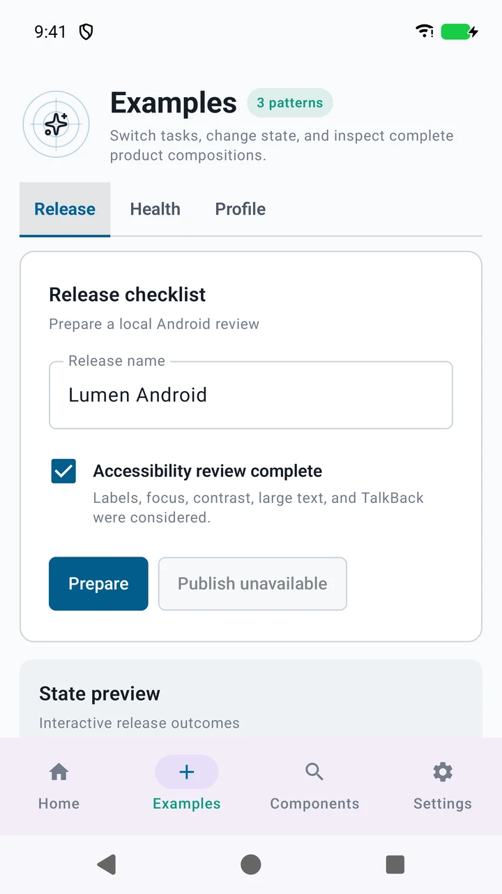

<p align="center">
  <a href="https://lumen.santi020k.com">
    <picture>
      <source media="(prefers-color-scheme: dark)" srcset="../../docs/assets/readme/package-dark.svg">
      
    </picture>
  </a>
</p>

<h1 align="center">Lumen Android Playground</h1>

<p align="center">Jetpack Compose · Phones, tablets, and Wear OS</p>

<p align="center"><a href="https://play.google.com/store/apps/details?id=com.santi020k.lumen.playground.compose">Google Play</a> · <a href="https://lumen.santi020k.com/docs/android/playground">Playground guide</a> · <a href="../../packages/compose/README.md">Compose package</a></p>

**On this page:** [Overview](#overview) · [Run locally](#run-locally) · [Candidate artifact checks](#candidate-artifact-checks) · [Process-death restoration test](#process-death-restoration-test) · [Isolated runtime measurements](#isolated-runtime-measurements) · [Resources](#resources)

<p align="center">
  
</p>

<p align="center"><em>Native playground capture. Store builds follow their own release schedule.</em></p>

## Overview

<!-- cspell:words screencap Automator Pandroid keyboardqualification performancequalification -->

A polished Jetpack Compose reference application for `lumen-compose`, plus a focused Wear
application that compiles the separate `lumen-compose-wear` artifact. The phone experience has four
adaptive destinations: Home, complete Examples, the searchable Components catalog, and Settings.
Install the phone gallery from
[Google Play](https://play.google.com/store/apps/details?id=com.santi020k.lumen.playground.compose),
or build it locally using the instructions below.
Home presents the checked-in component and category totals as a release workspace. Examples includes
interactive release-readiness, catalog-health, and profile patterns with representative product
states. The Motion pattern demonstrates expandable content, simulated save feedback, and a native
sheet. Its local reduction toggle disables demo effects; native sheet motion follows Android's
animation scale. Normal Components launches add category discovery, while Settings demonstrates
Normal, Studio, Glass and santi020k themes, light and dark appearance, and groups accessibility, platform,
privacy, and support information. Wide windows use paired panes alongside
the adaptive navigation rail instead of stretching the phone layout.

The Components destination preserves the complete basic and complex catalog: foundations, actions, forms,
feedback, visual content, structured data, controlled overlays, Android sharing, bottom
navigation, navigation accessories, and adaptive navigation within the same six discovery categories
used by the other phone playgrounds. The Wear gallery renders every API
in its intentionally smaller package, including the supported metric and list-row
compositions.

> **Local candidate:** This checkout uses the Lumen 4 adapter. Search accepts component IDs and
> supports filter reset. See the [v4 playground guide](../../docs/playgrounds.md#lumen-4-candidate)
> for release-version display and capture behavior.

## Run locally

Open this directory, not the repository root, in Android Studio. Wait for Gradle sync, select an
emulator or connected device, and run the `app` configuration. Android SDK 37 and JDK 21
are required.

Alternatively, build an installable debug APK from the repository root:

```bash
pnpm playground:android:build
```

The phone and watch APKs are written beneath `app/build/outputs/apk/debug` and
`wear/build/outputs/apk/debug`. See
[`docs/playgrounds.md`](../../docs/playgrounds.md) for prerequisites, device installation, signing,
and Google Play distribution.

## Candidate artifact checks

Release canaries first publish the candidate AARs to the local staging repository, then force both
consumers to resolve those artifacts instead of the included source build:

```bash
(cd packages/compose && ./gradlew verifyMavenPublication)
./packages/compose/gradlew -p apps/playground-android \
  -PlumenComposeRepository=../../packages/compose/build/central-staging \
  assembleDebug :app:verifyLumenArtifactIsolation
```

## Process-death restoration test

The `restoration-driver` module runs instrumentation in a separate process so it can terminate the
playground process without terminating its own assertions. It uses test-only UI Automator 2.4.0.
The explicit debug qualification profile installs a separate app ID and does not change the
normal debug or release application. Select one task-owned emulator with `ANDROID_SERIAL`.

```bash
ANDROID_SERIAL=<emulator-serial> ./packages/compose/gradlew -p apps/playground-android \
  :app:installDebug -PlumenQualification=true
ANDROID_SERIAL=<emulator-serial> ./packages/compose/gradlew -p apps/playground-android \
  :restoration-driver:connectedDebugAndroidTest :restoration-driver:lintDebug \
  -PlumenQualification=true \
  -Pandroid.testInstrumentationRunnerArguments.class=com.santi020k.lumen.playground.restoration.WorkspaceProcessDeathTest \
  -Pandroid.testInstrumentationRunnerArguments.targetPackage=com.santi020k.lumen.playground.compose.keyboardqualification
```

The target must already be installed. The driver accepts only that isolated qualification package,
starts a fresh task, edits the last workspace record with a 1,160-character unsaved note, then
backgrounds the target and uses `am kill`. It requires the old PID to disappear and the restored
activity to run in a new process before checking the exact draft. It saves the record, repeats the
process kill, and checks saved feedback and the exact reopened note. It does not clear app storage,
kill the public installation or use force-stop as restoration evidence. Instrumentation results
are written beneath `restoration-driver/build/outputs/androidTest-results`. This emulator test
does not establish physical-device qualification, persistent storage across removed tasks, or
startup/scrolling performance.

## Isolated runtime measurements

The `benchmark` variant inherits release settings, disables debugging, uses the standard development
certificate and installs as a separate `.performancequalification` application. The runtime test
runs in the driver process and only accepts that package. It makes five process-cold launches,
then collects frame snapshots for six workspace list scrolls and checks that visible records move.

```bash
ANDROID_SERIAL=<emulator-serial> ./packages/compose/gradlew -p apps/playground-android \
  :app:installBenchmark
ANDROID_SERIAL=<emulator-serial> ./packages/compose/gradlew -p apps/playground-android \
  :restoration-driver:connectedDebugAndroidTest :restoration-driver:lintDebug \
  -Pandroid.testInstrumentationRunnerArguments.class=com.santi020k.lumen.playground.restoration.WorkspaceRuntimePerformanceTest \
  -Pandroid.testInstrumentationRunnerArguments.targetPackage=com.santi020k.lumen.playground.compose.performancequalification
```

Select the test class explicitly: process restoration and runtime measurement use different
isolated installations. The test log records the exact `/data/local/tmp/lumen-workspace-runtime-*`
sample directory and before/after record ranges. Pull that directory using the selected emulator:

```bash
adb -s <emulator-serial> pull <recorded-sample-directory> .build/workspace-runtime-samples
node scripts/report-android-workspace-runtime.mjs --input .build/workspace-runtime-samples \
  --output .build/workspace-runtime-report.json
```

Preserve the benchmark APK, installed checksum, source revision, device settings, instrumentation
results and raw samples together. The reporter reuses the strict Android timing/frame parsers,
deduplicates snapshots and marks future completion timestamps as Partial. It does not establish a
passing budget or hardware qualification. See [runtime performance](../../docs/native-runtime-performance.md)
for metric definitions and remaining boundaries.

## Component screenshots

Install both debug applications on a phone emulator and a Wear emulator (or run the command once
per connected target), then capture deterministic component states with:

```bash
./scripts/capture-component-screenshots.sh
```

The default phone component list is generated from `registry/native-playground-catalog.json` by
`pnpm run generate:native-playground-catalogs`, alongside the app catalogs. Explicit component
arguments still select a focused capture.

Captures temporarily disable Android transition animations and restore the original settings on
exit, including failures. CI retains capture PNGs with the Android test reports for visual failure
diagnosis.

The script writes one phone PNG per public component and a Wear catalog PNG beneath
`build/screenshots`. It starts the phone activity with the `component` intent extra, which filters
the gallery to the relevant section and opens the alert dialog, sheet, or menu when that overlay is
the requested capture. Component-intent launches render the catalog directly so reference-app
navigation does not alter deterministic documentation captures. The output is temporary
verification evidence and is intentionally kept out of source control. Run
`pnpm run sync:native-captures` from the repository root after both device sets are current to update
the optimized documentation gallery and integrity manifest.

To capture one state manually:

```bash
adb shell am start -W \
  -n com.santi020k.lumen.playground.compose/.MainActivity \
  --es component '"Adaptive navigation scaffold"'
adb exec-out screencap -p > adaptive-navigation-scaffold.png
```

Add `--ez darkTheme true` to the activity launch command for a deterministic dark appearance.

Production delivery uses the **Release Android playground beta** GitHub workflow from merged
`main`. It verifies the approved Lumen source before loading signing credentials from Infisical;
dispatches from other branches are skipped. Store delivery uses `--require-current-approval`, so
publishing a library tag does not exempt later uploads from exact-source approval. A source change
requires a fresh matching approval before delivery. Local signed builds are development preflight only.
Google Play automatically submits committed changes for review. Prepare the listing before dispatch
and keep managed publishing enabled to hold approved changes for the intended rollout.

Public Google Play copy, the data-safety declaration, feature graphic, icon, and phone screenshot
candidates live in `Store`; regenerate raster assets from the shared Lumen mark with
`scripts/generate-app-icons.sh`. Follow
[`docs/playground-publication.md`](../../docs/playground-publication.md) before building a signed
closed-testing or production bundle. Use `pnpm playground:android:bundle:signed` for an upload
candidate. The command injects the four upload-key values from Infisical path
`dev:/playground/google-play`, decodes the keystore only for the duration of the build, and fails
unless every signing value is present and valid.

With the phone app installed on a booted emulator, capture the ordered Google Play set with:

```bash
pnpm playground:android:capture-store
```

The command temporarily configures a 2160×3840 9:16 viewport, captures six native Home, Examples,
Components, and Settings screens in light and dark appearances, and restores the emulator display.

## Resources

- [Repository overview](../../README.md) — framework packages, demos, and the project map.
- [Contributing](../../CONTRIBUTING.md) — workspace setup, validation, and release workflow.
- [Feedback and support](https://lumen.santi020k.com/support) — questions, ideas, and bug reports.

Part of [Lumen UI](https://lumen.santi020k.com), created by [Santiago Molina](https://santi020k.com).
Licensed under [MIT](../../LICENSE); third-party artwork retains its own notices.
