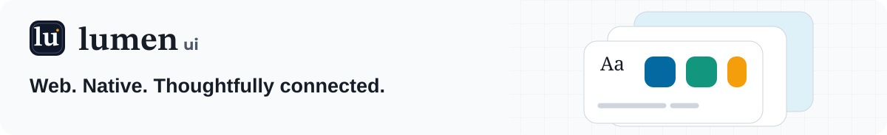
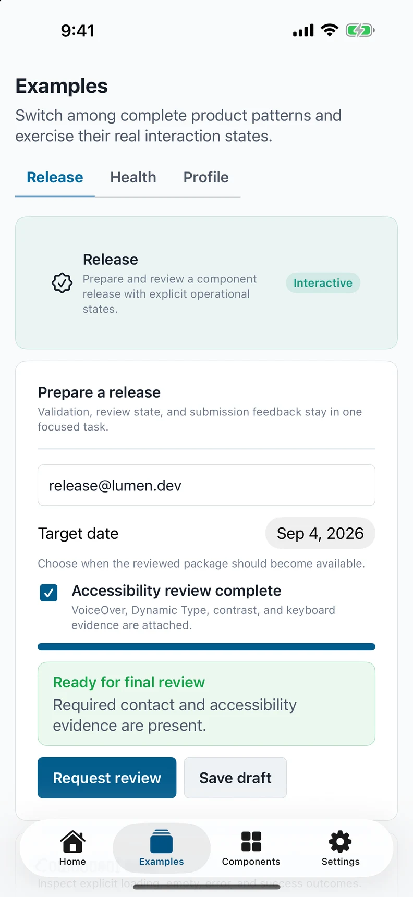

<p align="center">
  <a href="https://lumen.santi020k.com">
    <picture>
      <source media="(prefers-color-scheme: dark)" srcset="../../docs/assets/readme/package-dark.svg">
      
    </picture>
  </a>
</p>

<h1 align="center">Lumen Apple Playground</h1>

<p align="center">SwiftUI · iPhone, iPad, Mac, and Apple Watch</p>

<p align="center"><a href="https://apps.apple.com/app/id6805250815">App Store</a> · <a href="https://lumen.santi020k.com/docs/apple/playground">Playground guide</a> · <a href="../../packages/swift/README.md">SwiftUI package</a></p>

**On this page:** [Overview](#overview) · [Run locally](#run-locally) · [Distribution](#distribution) · [Workspace runtime tests](#workspace-runtime-tests) · [Widget component previews](#widget-component-previews) · [Resources](#resources)

<p align="center">
  
</p>

<p align="center"><em>Native playground capture. Store builds follow their own release schedule.</em></p>

## Overview

<!-- cspell:words screencapture simctl UDID -->

Install [Lumen Playground from the App Store](https://apps.apple.com/app/id6805250815)
on iPhone, iPad, or Mac to explore the native gallery without building it locally.
See the [Apple playground guide](https://lumen.santi020k.com/docs/apple/playground)
for component previews and setup instructions.

A SwiftUI reference application for the shared and Apple-specific `LumenUI` components. Its four
primary destinations are Home, Examples, Components, and Settings:

- Home is a component-release workspace with factual catalog readiness, quick actions, featured
  workflows, and category distribution.
- Examples provides interactive release, catalog-health, and contributor-profile patterns,
  including loading, empty, error, success, disabled, validation, and destructive states.
  The Motion pattern adds expandable content, simulated save feedback, and a native sheet. Demo
  effects respect Reduce Motion and a local reduction toggle; sheet presentation follows the system.
- Components adds the shared six-category discovery structure to the searchable catalog while preserving the
  deterministic launch filters used by screenshot automation.
- Settings offers Normal, Studio, Glass and santi020k themes alongside light/dark appearance,
  Accessibility, Runtime localization, App and platform, and Privacy
  and resources using native SwiftUI behavior.

> **Local candidate:** This checkout uses the Lumen 4 adapter. Search accepts component IDs and
> supports filter reset. See the [v4 playground guide](../../docs/playgrounds.md#lumen-4-candidate)
> for release-version display and capture behavior.

## Run locally

Use the [declared Apple toolchain](../../docs/native-compatibility.md) and open this app directory.

To run on iOS, open `LumenApplePlayground.xcodeproj`, select an iPhone simulator, and press
`Command-R`. Simulator builds do not require an Apple Developer account. The iOS application embeds
the `LumenWidgetPlayground` extension, a small WidgetKit host for the public `LumenWidgetUI` product.
After installing the application, add **Lumen Widget** from the Home Screen or Lock Screen widget
gallery to verify full-color, accented, increased-contrast, and accessibility-text rendering on the
actual device. The widget keeps its timeline, supported families, and container background in the
playground rather than moving product policy into Lumen.

Run the macOS gallery from the repository root as a Swift Package executable:

```bash
pnpm playground:apple:build
swift run --package-path apps/playground-apple LumenApplePlayground
```

The Mac home screen presents a live editable project preview, catalog metrics, and category cards
that open the corresponding component filter. Its desktop sidebar includes destination descriptions,
the adapter version, and author attribution. Theme and appearance pickers stay available in the
window toolbar. The home composition stacks in narrower windows; the iPhone and iPad home screen
and deterministic `--component` captures keep their existing layout. The preview is local and
in-memory: Create confirms the entered project name without creating a persisted project.

For a local Mac app with the Lumen icon, application name, About metadata, and native menus:

```bash
pnpm playground:mac:app
open "apps/playground-apple/.build/mac-app/Build/Products/Debug/Lumen Playground.app"
```

This command uses the existing Xcode target and icon catalog, then signs the local Debug bundle
ad hoc without requiring a development team. The local bundle identifier is separate from the
App Store app, so development builds do not replace it. Set `LUMEN_MAC_BUILD_PATH` to use a different
build directory. A raw `swift run` executable remains useful for development but does not include
application-bundle metadata or the Dock icon.

The Navigate menu supports **Command-1** through **Command-4** for Home, Examples, Components, and
Settings. **Command-comma** opens Settings in the active playground window. The View menu provides
the native sidebar toggle, and Help links to the playground guide and component documentation.
Navigation commands are disabled in deterministic component captures and when no gallery window
is active. Each window keeps its own destination and theme controls.

For the distributable macOS application, open `LumenApplePlayground.xcodeproj`, select the shared
`LumenMacPlayground` scheme, and run on **My Mac**. The target reuses the same gallery sources while
adding the App Sandbox, hardened runtime, application metadata, and complete Mac icon set required
for Mac App Store distribution.

Select a development team in Signing & Capabilities only when installing on a physical device or
archiving for TestFlight. Update `project.yml` and regenerate the Xcode project with XcodeGen when
project structure changes.

## Distribution

Run the local preflight from the repository root with
`pnpm playground:apple:release-preflight`. It checks release metadata, runs Swift tests, and builds
unsigned iOS Simulator and macOS archive candidates, including a check that every macOS app file
is readable and every directory is traversable by ordinary users.

For this public repository, **Launch Apple playground release** and **Launch Mac playground release**
route delivery through the [Public Apple store delivery workflow](../../.github/workflows/apple-store-release.yml)
on standard GitHub-hosted macOS runners. It requires approved, merged `main`, passing checks, and
protected Infisical signing credentials. Private repository deployments use Xcode Cloud through
the workflows' visibility gates. Store review and customer rollout remain separate from upload.

Delivery imports credentials into a temporary keychain with access restricted to Apple's signing
tools. macOS also authorizes the installer signing tools so package export can run unattended;
the keychain and newly installed distribution profiles are removed when delivery exits. Signing
credentials remain private under `umask 077`; Xcode archive and export subprocesses use `umask 022`
so packaged resources remain readable after installation. The macOS archive permissions check runs
before export and upload.

See [`docs/playgrounds.md`](../../docs/playgrounds.md) for prerequisites and the complete Xcode,
device, signing, and TestFlight workflow.

## Workspace runtime tests

The separate `LumenApplePlaygroundPerformance` scheme runs Release-mode UI tests for responsive
application launch, list scrolling and saving long notes while the keyboard is visible. The test
requests scrolling-hitch measurements on iOS 26 or later alongside the scrolling duration.
Its runner requires iOS 17 or later; the playground application's iOS 16 minimum is unchanged.
See [native runtime performance](../../docs/native-runtime-performance.md) for the local command,
metric interpretation and result-bundle inspection. This scheme does not change archive or
distribution schemes.

The same scheme includes `AdvancedInputTests` for native password reveal/reset, exact number
stepping, Spanish drafts, autocomplete selection and captures of all six advanced controls. Run
only these tests on a dedicated simulator with:

```bash
xcodebuild -project apps/playground-apple/LumenApplePlayground.xcodeproj \
  -scheme LumenApplePlaygroundPerformance \
  -destination 'platform=iOS Simulator,id=<owned-simulator-udid>' \
  -only-testing:LumenApplePlaygroundUITests/AdvancedInputTests \
  CODE_SIGNING_ALLOWED=NO test
```

Simulator results complement the unit tests and do not replace physical-device autofill,
VoiceOver, TalkBack or minimum-operating-system qualification.

## Widget component previews

Generate the four WidgetKit primitive examples with the actual `LumenWidgetUI` views:

```bash
swift run --package-path apps/playground-apple LumenWidgetCaptures apps/playground-apple/Screenshots/widgets
pnpm run sync:native-captures -- --platform=apple --components=widget-text,widget-icon,widget-badge,widget-compact-stat
```

These are light-mode macOS SwiftUI renders, labeled as previews in the documentation. They show
text, icon, badge and compact-stat styling; they do not verify WidgetKit timelines, extension
rendering modes, App Intents or device behavior. Run the Swift command on macOS from the repository
root. The generated PNG files remain local; the capture synchronization script publishes the WebP
examples and their digest manifest.

## Mac appearance and secondary views

The Mac shell resolves System from the application's effective appearance, independently of the
window override. Switching Dark → System or Light → System updates native window chrome and Lumen
surfaces together, and System follows subsequent macOS appearance changes. Theme changes preserve
mounted controls and example state.

Examples, Components, and Settings share the home's semantic backdrop and desktop heading style.
Settings places appearance controls beside a live surface preview when space permits, then groups
accessibility, build details, localization, and resources in responsive cards. Narrow windows stack
those groups. Component launch filters retain the compact deterministic capture layout.

For regression verification, switch Dark → System → Light → System on Settings and through the
toolbar on Examples and Components. Confirm selected menu values remain visible, entered demo
values survive appearance changes, and light/dark chrome matches the preview. Inspect both the
1240 × 860 default window and the 760 × 620 minimum window.

## Component screenshots

Every catalog entry accepts a launch filter so visual evidence is deterministic. In Xcode, add
`--component` and a component name such as `Navigation bar` to the scheme's launch arguments.
Filtered launches open Components directly rather than the four-destination application shell.
For deterministic full-page verification, pass `--destination` with `home`, `examples`,
`components`, or `settings`; `--component` continues to take precedence when both are supplied.

To build the iOS playground, boot the first available iPhone simulator, and capture one PNG for
each component usage:

```bash
apps/playground-apple/scripts/capture-component-screenshots.sh
```

Screenshots are written to `apps/playground-apple/Screenshots` and remain local verification
artifacts. Pass a destination directory as the first argument when preparing release evidence. Set
`LUMEN_SIMULATOR_UDID` to capture with a specific available simulator. Set
`LUMEN_CAPTURE_SETTLE_SECONDS=10` if a cold launch needs longer than the default six seconds to finish its initial layout. The script uses the checked-in
Xcode project, disables code signing for the simulator build, and waits for each filtered gallery
state before capture.

The macOS gallery supports the same filter. Launch each macOS-only component, then use the standard
window-capture cursor to select the playground window:

```bash
mkdir -p apps/playground-apple/Screenshots
swift run --package-path apps/playground-apple LumenApplePlayground --component "Shortcut recorder"
screencapture -w apps/playground-apple/Screenshots/shortcut-recorder.png

swift run --package-path apps/playground-apple LumenApplePlayground --component "Symbol picker"
screencapture -w apps/playground-apple/Screenshots/symbol-picker.png
```

macOS requests Screen Recording permission the first time `screencapture` runs. Window selection is
intentionally interactive so the script does not require Accessibility permission to control other
applications.

The repository also includes a standalone watchOS gallery. Capture every wearable component on a
booted watch simulator with:

```bash
apps/playground-apple/scripts/capture-watch-component-screenshots.sh
```

After iPhone, macOS, and watchOS evidence is current, run `pnpm run sync:native-captures` from the
repository root to update the optimized documentation gallery.

Pass `--dark` to launch either gallery in its deterministic dark appearance. Public App Store copy,
review notes, and phone, tablet, and Mac screenshot candidates live in `Store`; the opaque application
icon is generated from the shared Lumen mark with `scripts/generate-app-icons.sh`. Follow
[`docs/playground-publication.md`](../../docs/playground-publication.md) before building a signed
TestFlight or App Store archive.

Capture the ordered App Store set from Apple's current highest-resolution required iPhone and iPad
simulator classes with:

```bash
pnpm playground:apple:capture-store
```

The command produces six 1320×2868 iPhone screenshots and six 2064×2752 iPad screenshots across
Home, Examples, Components, and Settings, including light and dark appearances.

## Resources

- [Repository overview](../../README.md) — framework packages, demos, and the project map.
- [Contributing](../../CONTRIBUTING.md) — workspace setup, validation, and release workflow.
- [Feedback and support](https://lumen.santi020k.com/support) — questions, ideas, and bug reports.

Part of [Lumen UI](https://lumen.santi020k.com), created by [Santiago Molina](https://santi020k.com).
Licensed under [MIT](../../LICENSE); third-party artwork retains its own notices.
