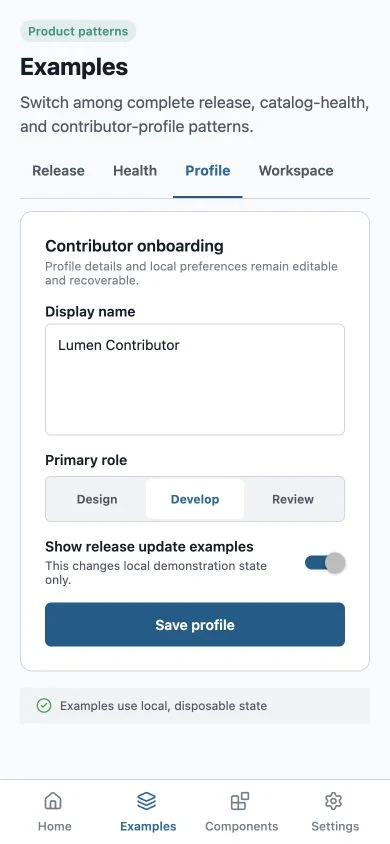

<p align="center">
  <a href="https://lumen.santi020k.com">
    <picture>
      <source media="(prefers-color-scheme: dark)" srcset="../../docs/assets/readme/package-dark.svg">
      
    </picture>
  </a>
</p>

<h1 align="center">Lumen React Native Playground</h1>

<p align="center">Expo · iOS, Android, and browser previews</p>

<p align="center"><a href="https://lumen.santi020k.com/docs/react-native/playground#preview">Browser preview</a> · <a href="../../docs/playgrounds.md">Setup guide</a> · <a href="../../packages/react-native/README.md">React Native package</a></p>

**On this page:** [Overview](#overview) · [Run locally](#run-locally) · [Native host configuration](#native-host-configuration) · [Open the published playground](#open-the-published-playground) · [App branding](#app-branding) · [Resources](#resources)

<p align="center">
  
</p>

<p align="center"><em>Expo browser preview; native rendering is verified separately.</em></p>

## Overview

<!-- cspell:words screencap simctl -->

An Expo reference app for every public component in `@santi020k/lumen-react-native`. It runs on
web, iOS, and Android with four focused destinations: Home, Examples, Components, and Settings.
Examples provides Release, Health, Profile, and Workspace patterns with switchable loading, empty, error, and
success states. The Motion pattern demonstrates expandable content, simulated save feedback, and
a native sheet. Demo effects respect the system motion preference and a local reduction toggle;
sheet presentation follows the operating system. Components combines
search, product-intent categories, and focused component detail views. Settings includes Lumen and
santi020k theme presets, system/light/dark appearance, live accessibility context, runtime
localization, app details, privacy, and resources.

> **Local candidate:** This checkout uses the Lumen 4 adapter. Search accepts component IDs and
> supports filter reset. See the [v4 playground guide](../../docs/playgrounds.md#lumen-4-candidate)
> for release-version display and capture behavior.

## Run locally

Install the repository dependencies once from the repository root:

```bash
pnpm install --frozen-lockfile
```

Then start Expo:

```bash
pnpm playground:react-native
pnpm playground:react-native:web
```

Scan the Expo QR code, or press `i`, `a`, or `w` to choose iOS, Android, or web. See
[`docs/playgrounds.md`](../../docs/playgrounds.md) for prerequisites, EAS setup, APK generation, and
store distribution profiles.

## Native host configuration

The SDK 57 configuration enables iOS scene support through `expo-build-properties` so native
builds made with Xcode 27 launch on iOS and iPadOS 27. Keep this opt-in until the Expo SDK upgrade;
Expo SDK 58 adopts scenes by default. Regenerate the native host after changing the plugin settings.
See Expo's [scene lifecycle migration](https://github.com/expo/fyi/blob/main/ios-scene-lifecycle.md).

The local Android splash plugin runs after Expo's resource generation. Expo SDK 57's splash plugin
places `android:windowSplashScreenBehavior` in the base style even though that attribute requires
API 33. Lumen moves it to a complete `values-v33` splash style while preserving the common items
for older Android versions. Keep the Android minimum SDK unchanged and regenerate the native host
after plugin changes. Remove this local plugin once an SDK update generates correctly qualified
resources, then regenerate a clean Android host to retire its generated file. The plugin leaves
already-qualified styles intact and remains safe when applied more than once.
Plugin tests run with the playground tests, and the separate plugin type check uses Node types
without adding Node globals to the React Native app.

## Open the published playground

The public React Native playground runs in Expo Go rather than using an App Store or Google Play
listing. Open the stable link below on a device with Expo Go installed; it always resolves to the
latest update on the `expo-go` branch:

```text
exp://u.expo.dev/669035f0-04c0-41cd-9ca6-73d99bdb7dce/branch/01a03c76-64c5-7c07-ba75-43f815735357
```

The current app targets Expo SDK 57 and therefore requires an Expo Go client that supports SDK 57.
Check the installed Expo Go client's supported SDK before opening the link. If it does not
support SDK 57, use the local native development build described in the playground guide.
The browser preview remains available without an Expo Go installation.

Publish a new version from an authenticated Expo session with:

```bash
pnpm --filter @santi020k/lumen-playground-react-native run publish:expo-go -- --message "Describe the update"
```

This command changes the public playground. Run the app checks and native exports before publishing.

## App branding

Expo uses the canonical Lumen playground artwork for its project icon, iOS icon, Android legacy and
adaptive icons, splash screen, and web favicon. Regenerate those PNG assets after changing the
shared SVG sources:

```bash
pnpm --filter @santi020k/lumen-playground-react-native run generate:assets
```

The adaptive and splash artwork stays transparent over the configured Lumen background. The main
1024-pixel icon stays opaque for iOS and Expo project surfaces.

## Component coverage

The gallery includes every primary public React Native component: foundations, inputs and
selection, feedback, structured content, visual treatments, controlled overlays, operating-system
sharing, pull-to-refresh, and static or collapsible bottom navigation. Composite contracts such as
`LumenAlertTitle` and `LumenAlertDescription` appear inside their parent example. Search uses the
same names as the public API matrix and keeps every example interactive.

On web, add `?component=<name>` to open a screenshot-ready focused view. Use `category=<name>` for
category discovery, `destination=home|examples|components|settings` to open an application
destination, `pattern=release|health|profile|workspace|motion` to select an Examples pattern, and
`state=loading|empty|error|success` to prepare its state lab. For example:

```text
http://localhost:8081/?component=Alert%20dialog
http://localhost:8081/?component=Illustration
http://localhost:8081/?component=Navigation%20bar
http://localhost:8081/?destination=examples&state=error
http://localhost:8081/?destination=examples&pattern=profile
http://localhost:8081/?destination=components&category=forms
```

The existing `embed=true`, `scheme=light|dark|system`, and `theme=lumen|santi020k` parameters remain
available for documentation previews. Embedded component captures continue to match component names
exactly and omit the application shell.

After starting `pnpm playground:react-native:web`, capture every documented component from the
repository root:

```bash
pnpm playground:react-native:capture
```

Use the gallery search before capturing a native simulator or device so one component family fills
the viewport. Native captures retain platform rendering and system sheets that Expo Web cannot
prove:

```bash
xcrun simctl io booted screenshot test-results/react-native-components/ios-illustration.png
adb exec-out screencap -p > test-results/react-native-components/android-illustration.png
```

The capture command deep-links each catalog entry, opens deterministic dialog, sheet, and menu
states, and writes PNG sources beneath `test-results/react-native-components`. Those sources are
ignored verification evidence; `pnpm run sync:native-captures` publishes optimized WebP copies and
the checked-in integrity manifest. The operating-system share sheet must still be verified on iOS
or Android because browser support is environment-dependent.

## Appearance comparison

Open Settings to switch between Normal, Studio, Glass and santi020k without resetting example
inputs. Light, dark and system appearance remain independent. Glass keeps the adapter's opaque
material fallback. See [the playground guide](../../docs/playgrounds.md#appearance-comparison)
for browser regression checks and reproducible preview links.

## Live iOS text resizing

The workspace applies `patches/react-native@0.86.3.patch` through pnpm's exact-version
`patchedDependencies`. The Expo build-properties configuration builds React Native from source
and disables precompiled modules, so the corrected Fabric/Yoga layout code reaches iOS builds.
Installing a JavaScript update alone cannot update the native renderer. Regenerate native projects
and rebuild the app after installing dependencies.

The patch invalidates Yoga configuration and paragraph/prepared-layout caches when the system
font multiplier changes. It retains mounted input state and native text scaling; it does not
remount screens or disable accessibility scaling. `src/fixtures/TextLayoutProbe.tsx` is the local
regression fixture. On an already mounted screen, edit the draft, grow system Text Size from the
standard setting to its maximum, scroll to the paragraph's final sentence, and restore the standard
setting. Both plain React Native and Lumen text must wrap and the edited draft must survive.

This correction is specific to React Native 0.86.3. Reevaluate it against upstream changes before
upgrading. Native iOS source compilation takes longer than using the prebuilt renderer. The patch
is local application configuration, not a fix automatically installed by the published Lumen
package. Downstream apps affected by this version must apply the patch and rebuild their native
iOS renderer themselves. Android source builds and physical-device behavior need separate checks.

## Resources

- [Repository overview](../../README.md) — framework packages, demos, and the project map.
- [Contributing](../../CONTRIBUTING.md) — workspace setup, validation, and release workflow.
- [Feedback and support](https://lumen.santi020k.com/support) — questions, ideas, and bug reports.

Part of [Lumen UI](https://lumen.santi020k.com), created by [Santiago Molina](https://santi020k.com).
Licensed under [MIT](../../LICENSE); third-party artwork retains its own notices.
