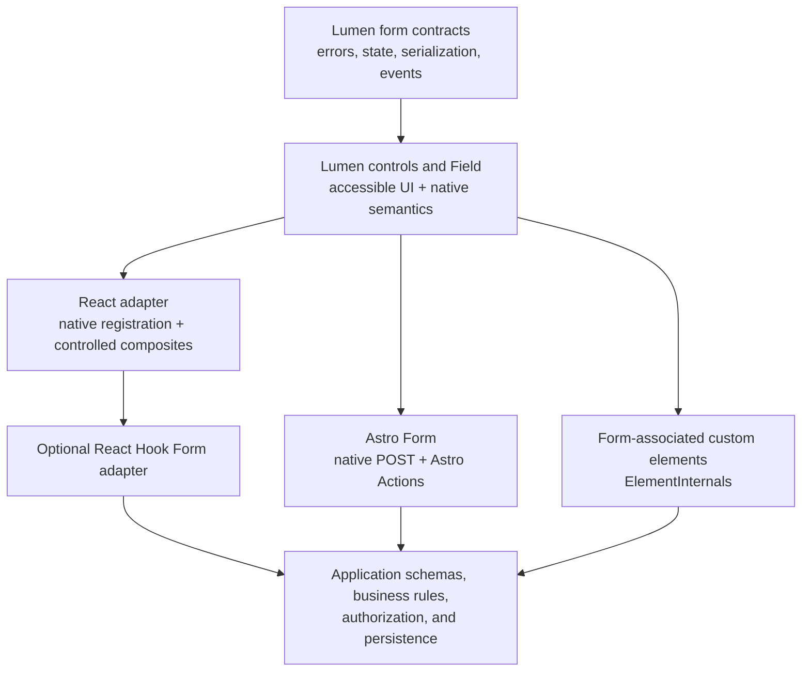

# Form System Roadmap

This plan defines how Lumen can become a dependable form system across React, Astro, and Web
Components without coupling the core library to one validation schema, server framework, or state
manager.

The recommended direction is:

- Lumen owns accessible controls, field composition, native form participation, visual states, and
  framework adapters.
- React Hook Form owns React form state when an application chooses it.
- Astro owns server Actions and request handling in Astro applications.
- The browser owns submission, reset, autofill, constraint validation, and `FormData` whenever
  possible.
- Applications own business validation, authorization, persistence, and domain-specific errors.

Lumen should not build a full alternative to React Hook Form for v1. Doing so would require Lumen to
own nested values, field arrays, async validation, resolvers, dirty and touched tracking, conditional
fields, subscriptions, and render performance. That work would duplicate a mature ecosystem and
distract from cross-framework control quality.

## Current Baseline

Lumen already has useful form foundations:

- Astro forms opt into enhanced native validation with `data-ui-form` and `UIPrimitives`.
- React exposes `useFormValidation`, including form props, native validity checks, field error
  reflection, and `ui:validate`, `ui:valid`, and `ui:invalid` events.
- Elements can enhance native forms with the same validation events.
- `Field` can connect controls to hints and errors.
- Several composite controls preserve an internal native input or select for submission.
- The catalog already includes advanced controls such as `Select`, `DatePicker`, `DateRangePicker`,
  `InputOTP`, `ColorPicker`, `FileUpload`, and `TreeSelect`.

The current gaps are architectural:

- Validation logic is repeated in the Astro runtime, React hook, and Elements runtime.
- There is no public `Form` component or shared form-state contract.
- React ref support and value/change contracts are not yet uniform across all controls.
- There is no tested React Hook Form integration.
- Elements form participation depends on embedded native controls for some components; base custom
  elements are not form-associated controls.
- Server errors, pending submission, success, reset, and error-summary behavior are not unified.
- Advanced controls do not yet have one documented serialization format across frameworks.

## Target Architecture



The shared layer must contain contracts and pure helpers, not framework state. Each adapter should
feel native to its framework while producing equivalent values, errors, validity, and events.

## Ownership Boundaries

### Lumen owns

- Control names, values, disabled and read-only state, and reset behavior.
- Label, hint, description, and error associations.
- Visual states for pristine, dirty, pending, valid, invalid, success, and disabled controls.
- Error summary focus and navigation.
- Serialization rules for composite controls.
- Accessible focus on the first invalid control.
- Stable events and field-state data attributes.
- Integration adapters and examples.

### Integrations own

- React Hook Form: registration, subscriptions, dirty and touched state, field arrays, resolvers,
  and client-side submission state.
- Astro Actions: server input parsing, schema validation, action results, and redirects.
- Native HTML: ordinary submission, reset, autofill, password managers, and constraint validation.
- Validation libraries: schema definition and business validation.

### Applications own

- Authentication, authorization, rate limiting, and cross-site request forgery protection.
- Database writes and side effects.
- Domain error copy and localization.
- Whether client validation mirrors server validation.
- Analytics and product-specific submission flows.

## Proposed Shared Contracts

The exact names require an RFC before implementation, but the system needs equivalents of:

- `LumenFormStatus`: `idle`, `validating`, `submitting`, `success`, or `error`.
- `LumenFieldError`: field name, message, error code, and optional metadata.
- `LumenFormErrors`: an ordered collection of field errors plus optional form-level errors.
- `LumenFormResult`: success data or normalized form errors.
- `LumenFormValue`: the supported scalar, file, repeated, and composite value shapes.
- A stable mapping from server errors to `Field` and `ErrorSummary`.
- Serialization and parsing helpers for controls whose UI value differs from their submitted value.

Shared helpers should be pure and live in `packages/core`. DOM synchronization belongs in the
framework packages.

## Public Form Building Blocks

### Form

`Form` should remain a semantic native form.

- Astro renders `<form data-ui-form>`.
- React renders `<form>` and composes consumer event handlers.
- Elements enhances a native `<form data-ui-form>` instead of introducing a `lumen-form` element
  that would weaken native semantics.
- The form can expose validation timing, pending state, error-summary ownership, and standardized
  events without intercepting a valid native submission by default.

### Field

`Field` becomes the stable bridge between any validation source and Lumen presentation.

- It accepts control ID, hint ID, error ID, invalid state, required state, and error message through
  public framework-native APIs.
- It never assumes that an error came from native validity, React Hook Form, or an Astro Action.
- It preserves application-supplied `aria-describedby` IDs.
- It does not erase an error until the owning validation source clears it.

### ErrorSummary

Add `ErrorSummary` after the field error contract is stable.

- It renders form-level and field-level errors in submission order.
- Field error links focus the associated control, including composite controls.
- It receives focus only after a failed submit, not after ordinary blur validation.
- It uses a heading and an appropriate live-region strategy without announcing every keystroke.

### SubmitButton

Do not require a special submit button. The existing `Button type="submit"` should support form
pending state through ordinary props and form data attributes. A future convenience component is
acceptable only if real consumers repeatedly need it.

## React Plan

React should support two integration levels.

### Level 1: direct React Hook Form registration

Native-backed controls should work with `register()` and no Lumen-specific adapter:

```tsx
const {
  formState: { errors },
  handleSubmit,
  register
} = useForm<ProfileValues>()

<Form onSubmit={handleSubmit(saveProfile)}>
  <Field controlId="email" invalid={Boolean(errors.email)}>
    <Label htmlFor="email">Email</Label>
    <Input id="email" type="email" {...register('email', { required: 'Email is required' })} />
    <FieldError>{errors.email?.message}</FieldError>
  </Field>
  <Button type="submit">Save</Button>
</Form>
```

Before documenting this, every native-backed React control must:

- Accept a ref that reaches the submitted native control.
- Preserve `name`, `onBlur`, `onChange`, `disabled`, `required`, and native validation attributes.
- Compose handlers without changing call order or swallowing the consumer event.
- Avoid switching between controlled and uncontrolled state.
- Expose the real control to React Hook Form focus management.

The direct-registration conformance list should include `Input`, `Textarea`, `Checkbox`, `Switch`,
`Slider`, `NativeSelect`, `NumberField`, `SearchField`, `TimeField`, and `FileUpload`.

### Level 2: optional adapter for composite controls

Composite controls whose value or event shape is not a native input contract should integrate
through `Controller` or `useController`.

Candidates include `Select`, `DatePicker`, `DateRangePicker`, `InputOTP`, `ColorPicker`,
`Autocomplete`, `Combobox`, `TagGroup`, `Cascader`, and `TreeSelect`.

Create a separate optional package such as `@santi020k/lumen-react-hook-form` rather than adding
React Hook Form to `@santi020k/lumen-react` dependencies. The adapter package should:

- Declare supported React Hook Form versions as a peer dependency.
- Translate `field.value`, `field.onChange`, `field.onBlur`, `field.name`, `field.disabled`, and
  `field.ref` into each composite control's public contract.
- Translate `fieldState.invalid` and `fieldState.error` into `Field` presentation.
- Preserve the underlying native submitted value when the component already has one.
- Provide typed examples for scalar values, arrays, files, date ranges, and field arrays.
- Avoid wrapping controls that already work correctly with `register()`.
- Avoid owning schema resolvers; consumers can use the resolver ecosystem directly.

Start with examples and small adapter hooks. Add wrapper components only when they remove repeated
consumer code without hiding React Hook Form behavior.

### Relationship with `useFormValidation`

Keep `useFormValidation` for React applications that want native constraint validation without
React Hook Form. Do not mount both validation owners on the same form by default.

Document two explicit modes:

1. Native mode: Lumen `Form` plus `useFormValidation`.
2. Managed mode: React Hook Form owns validation state; Lumen only reflects errors and status.

If both are intentionally combined, define which source wins and prevent duplicate focus, duplicate
announcements, and duplicate submission prevention.

## Astro Plan

Astro should remain native-first and progressively enhanced.

### Native form baseline

`Form.astro` should render a real form with:

- `method`, `action`, `enctype`, `target`, `autocomplete`, and native attributes passed through.
- `data-ui-form` when Lumen validation enhancement is enabled.
- Useful server-rendered field values and errors before JavaScript loads.
- No requirement for a client island or React runtime.

A plain endpoint, external service, or any server framework must continue to work.

### Astro Actions integration

Provide a documented first-party recipe for Astro Actions rather than hiding Actions behind a
Lumen abstraction.

The recipe should cover:

- `accept: 'form'` Actions.
- Native `method="POST"` and `action={actions.example}` submissions.
- `Astro.getActionResult()` and input error detection.
- Mapping Action field errors into `Field` and `ErrorSummary`.
- Preserving values after a rejected submission.
- The POST/Redirect/GET pattern after success.
- File uploads with `multipart/form-data`.
- Authorization and rate limiting in the Action handler.

An optional helper may normalize Action field errors into `LumenFormErrors`, but Lumen should not
wrap `defineAction`, require Zod, or own redirects.

### Optional client enhancement

After the no-JavaScript path works, a small selector-gated controller may add:

- Pending state and `aria-busy`.
- Double-submit protection.
- A cancellable submission hook for client-side Action calls.
- Focus of `ErrorSummary` after server validation failure.
- Success and failure events.
- Safe reinitialization after Astro view transitions.

Client enhancement must not change the submitted `FormData` or make the form unusable when the
runtime fails.

## Web Components Plan

The Elements package needs the most foundational work.

### Native form as the container

Continue using a native `<form data-ui-form>`. Do not create a custom form element merely for API
symmetry.

### Form-associated custom controls

Input-like autonomous custom elements should use the platform's form-associated custom element
contract:

- `static formAssociated = true`.
- `attachInternals()` and `ElementInternals`.
- `setFormValue()` whenever the public value changes.
- `setValidity()` with a focusable internal control as the validation anchor.
- `form`, `labels`, `name`, `type`, `validity`, `validationMessage`, and `willValidate`.
- `checkValidity()` and `reportValidity()`.
- `formAssociatedCallback`, `formDisabledCallback`, `formResetCallback`, and
  `formStateRestoreCallback`.

Each form control must also:

- Reflect `value`, `defaultValue`, `checked`, `defaultChecked`, `disabled`, `required`, `readOnly`,
  `min`, `max`, `step`, `pattern`, and `multiple` where applicable.
- Dispatch standard `input` and `change` events with appropriate bubbling and composition.
- Participate in `FormData`, `form.elements`, reset, browser validation, and state restoration.
- Support explicit association through the `form` attribute.
- Preserve label activation and accessible naming.

Use an internal native control where it improves browser behavior, but make the host's public form
contract authoritative. Do not submit both the host and an internal proxy value.

### Migration strategy

Changing existing elements into form-associated controls can be breaking. Implement in slices:

1. Audit which elements already generate native proxy controls.
2. Add form conformance tests before changing implementation.
3. Convert simple scalar controls first.
4. Convert checked and repeated-value controls.
5. Convert composite and multi-value controls.
6. Remove obsolete proxy inputs only after submission, reset, validation, and autofill parity pass.

If the browser support matrix requires a fallback, retain one hidden native proxy behind a
capability check and test that path separately.

## Validation and Error Flow

The same conceptual flow should work in every framework:

1. The control maintains a native-compatible submitted value.
2. Client validation may mark a field invalid, but it does not replace server validation.
3. Submission serializes through `FormData`.
4. The server returns success, field errors, or a form-level error.
5. Errors normalize into `LumenFormErrors`.
6. `Field` displays the nearest field error.
7. `ErrorSummary` receives focus after failed submission and links to invalid controls.
8. Correcting a field clears its server error only when the owning integration chooses to clear it.
9. Success may reset the form, preserve it, or redirect according to the application.

Never rely on color alone. Error text must be programmatically connected to its control.

## Composite Value Contracts

Before adapter work, define one submitted-value contract for every advanced control:

| Component | Recommended submitted value |
| --- | --- |
| `CheckboxGroup` | Repeated entries with the same field name |
| `Select` | One scalar value; repeated values only in multiple mode |
| `DatePicker` | ISO calendar date, `YYYY-MM-DD` |
| `DateRangePicker` | Two explicitly named ISO date entries |
| `TimeField` | Local time string with documented precision |
| `InputOTP` | One scalar string |
| `TagGroup` | Repeated entries or a documented `FormData` mapping |
| `FileUpload` | Native `File` entries |
| `ColorPicker` | One documented color serialization |
| `TreeSelect` and `Cascader` | Stable selected keys, not display labels |

Do not encode arrays or objects as undocumented comma-separated strings.

## Delivery Phases

### Phase 0: RFC and compatibility audit

- Inventory every form-like component in all three packages.
- Record native element, submitted value, event shape, ref target, reset behavior, and validation
  behavior.
- Decide stable form types, events, data attributes, and serialization.
- Mark breaking Elements changes for the v1 migration guide.

Exit gate: every control has an agreed target contract and migration classification.

### Phase 1: shared form contracts

- Add pure form types and normalization helpers to `packages/core`.
- Add `Form`, `FieldError`, and `ErrorSummary` metadata.
- Consolidate error-message and field-description behavior where it can be shared safely.
- Replace random description IDs with deterministic framework-appropriate IDs.

Exit gate: the same normalized error fixture produces the same field and summary order in every
package.

### Phase 2: native React and Astro forms

- Add React and Astro `Form` surfaces.
- Finish React ref and event pass-through for every native-backed control.
- Add pending, success, failure, and reset presentation contracts.
- Keep current native validation as the default optional enhancer.

Exit gate: native submission, reset, autofill, and first-invalid focus pass in React and Astro
consumer tests.

### Phase 3: React Hook Form adapter

- Publish direct `register()` examples.
- Add the optional adapter package for composite controls.
- Test client errors, schema resolver errors, server errors, reset, async defaults, field arrays,
  disabled controls, and focus.
- Add a Next.js or React SSR smoke consumer without making Next.js a dependency.

Exit gate: a representative profile form and a complex multi-value form require no private glue
components.

### Phase 4: Astro Actions

- Publish zero-JavaScript and progressively enhanced Action recipes.
- Normalize Action input errors.
- Add value preservation, error summary, pending state, file upload, redirect, and authorization
  examples.
- Test on-demand rendering and view transitions.

Exit gate: the same Astro form works with JavaScript disabled and enhanced, with equivalent
submitted values and server errors.

### Phase 5: form-associated Elements

- Implement the shared `ElementInternals` base behavior.
- Convert simple, checked, select-like, file, and composite controls in that order.
- Test explicit form association, reset, state restoration, constraint validation, and `FormData`.
- Verify label and screen-reader behavior in supported browsers.

Exit gate: every input-like Lumen element behaves like a native form control for its documented
contract.

### Phase 6: conformance and release

- Run the same fixtures through React, Astro, and Elements.
- Complete keyboard, screen-reader, autofill, mobile, and browser testing.
- Add framework-specific guides and a migration guide.
- Run release candidates in at least two consumer applications.

Exit gate: no adapter-specific patch is required by the release-candidate consumers.

## Conformance Matrix

Each input-like component must be tested for:

| Area | Required checks |
| --- | --- |
| Submission | `FormData`, repeated values, files, empty values, disabled omission |
| State | controlled, uncontrolled, defaults, dirty, touched, pending |
| Events | input, change, blur, invalid, submit, reset |
| Validation | native rules, custom rules, server errors, first-invalid focus |
| Lifecycle | mount, unmount, conditional fields, reset, state restore |
| Accessibility | label, description, error, required, invalid, disabled, read-only |
| Integration | React Hook Form, Astro Actions, native Elements form |
| Runtime | SSR, no JavaScript, view transitions, reconnect, nested forms rejected |

The test fixtures should compare observable behavior and submitted values rather than requiring
identical internal markup.

## Documentation Deliverables

- Native validation guide for every framework.
- React Hook Form guide with direct registration and controlled composite examples.
- Astro Actions guide with server errors and a no-JavaScript path.
- Elements form-associated control guide.
- Error summary and accessible validation guidance.
- Serialization reference for every advanced control.
- Migration guide for current Elements proxy behavior.
- Decision guide: native validation vs React Hook Form vs Astro Actions.

## Success Measures

- Native-backed React controls integrate with `register()` without wrappers.
- Composite React controls need only the published adapter.
- Astro forms submit and display server errors without client JavaScript.
- Elements controls appear correctly in `FormData` and reset through their owning form.
- The same fixture produces equivalent submitted values and error focus across frameworks.
- Consumer applications do not create private field wrappers solely to connect Lumen state and
  errors.
- React Hook Form, Astro, and validation libraries remain optional dependencies.

## Reference Material

- [React Hook Form repository and quick start](https://github.com/react-hook-form/react-hook-form)
- [React Hook Form register type and contract](https://github.com/react-hook-form/react-hook-form/blob/master/src/types/form.ts)
- [Astro Actions and HTML forms](https://docs.astro.build/en/guides/actions/)
- [HTML Standard: form-associated custom elements](https://html.spec.whatwg.org/dev/custom-elements.html)

